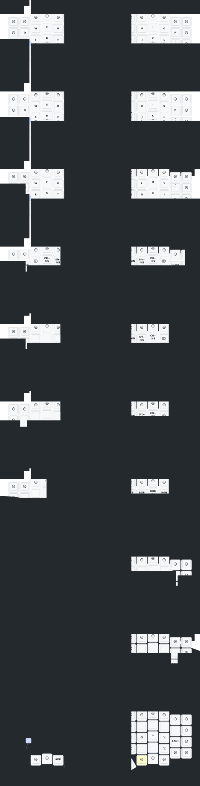

# Eyelash Sofle – Miryoku (QWERTY) ZMK Firmware

Personal ZMK firmware for the [Eyelash Sofle] split keyboard, running the
[Miryoku] layout with QWERTY alphas. Forked from the vendor-provided
[a741725193/zmk-sofle] repository so we can keep the Eyelash board
definition, DYA extensions, and studio support while replacing the stock
keymap with Miryoku.

[Eyelash Sofle]: https://github.com/a741725193/zmk-sofle
[Miryoku]: https://github.com/manna-harbour/miryoku
[a741725193/zmk-sofle]: https://github.com/a741725193/zmk-sofle

## Layout at a glance



> This SVG is regenerated automatically by the
> [keymap-drawer bot](https://github.com/caksoylar/keymap-drawer-action) on
> every push to `main`. If it looks stale, `git pull --rebase` — the bot
> commits directly on top of your push.

---

## Contents

- [What this firmware is](#what-this-firmware-is)
- [Hardware](#hardware)
- [Layout overview (Miryoku QWERTY)](#layout-overview-miryoku-qwerty)
- [Physical key mapping on the Eyelash Sofle](#physical-key-mapping-on-the-eyelash-sofle)
- [Design decisions](#design-decisions)
- [Preserved Eyelash-specific behaviour](#preserved-eyelash-specific-behaviour)
- [RGB, backlight, and power behaviour](#rgb-backlight-and-power-behaviour)
- [nice!view display](#niceview-display)
- [Modules in use / worth trying](#modules-in-use--worth-trying)
- [Building](#building)
- [Flashing](#flashing)
- [Studio (live remapping)](#studio-live-remapping)
- [Repository layout](#repository-layout)
- [Known issues / potential improvements](#known-issues--potential-improvements)
- [Credits](#credits)

---

## What this firmware is

- **Board / shield:** `nice_nano_v2` + `eyelash_sofle_left` / `eyelash_sofle_right`
  (plus a `settings_reset` build for wiping persisted settings).
- **ZMK upstream:** the `cormoran/zmk` fork on branch `v0.3-branch+dya` — this
  is what provides pointing, runtime sensor rotate, DYA studio, ble
  management, battery history, etc. See `config/west.yml`.
- **Layout:** [Miryoku] (Manna Harbour) — 30 alphas + 6 thumbs across
  10 layers, with home-row mods and layer-tap thumbs. QWERTY alpha variant.
- **Reference implementation:** the [miryoku_zmk] framework is vendored
  under `config/miryoku/`, and an Eyelash-Sofle-specific physical layout
  mapping lives at `config/miryoku/mapping/eyelash_sofle.h`.

[miryoku_zmk]: https://github.com/manna-harbour/miryoku_zmk

---

## Hardware

The Eyelash Sofle is a variant of the classic Sofle with:

- 5 × 14 matrix per side (columns 6 and, on row 4, columns 6 & 13 are
  skipped by the transform — **64 total addressable keys**:
  `13 + 13 + 13 + 13 + 12`).
- 6 columns × 4 rows per hand plus a thumb cluster,
- an extra "inner middle" column of 4 keys per hand (arrow diamond on
  the stock layout, wired to the **right** half),
- **one** EC11 rotary encoder (left half only — the right shield's
  `CONFIG_EC11=y` is a leftover with no corresponding DT node),
- WS2812 underglow: `chain-length = <7>` per side on `spi3` (14 LEDs
  total),
- a single amber PWM backlight LED (`pwm0`, GPIO P1.13, driven by
  `zmk,backlight`),
- a **nice!view** 68 × 140 monochrome SHARP Memory LCD stacked via
  `build.yaml` (`shield: eyelash_sofle_left|right nice_view`). The
  shield's `Kconfig.defconfig` defaults `CONFIG_SSD1306=y` as a fallback
  for units that ship with an SSD1306 OLED instead, but no matching DT
  node is present so that driver is dormant in this build.

See `boards/shields/eyelash_sofle/eyelash_sofle.dtsi` for the full DT.

---

## Layout overview (Miryoku QWERTY)

Miryoku uses ten layers. Only the base layer is active by default; the
others are held via a layer-tap on a thumb key on the opposite hand.

| #   | Layer  | Held from       | Purpose                                               |
| --- | ------ | --------------- | ----------------------------------------------------- |
| 0   | BASE   | –               | QWERTY alphas + home-row mods + layer-tap thumbs      |
| 1   | EXTRA  | – (via BASE)    | Alternate base (also QWERTY in this build)            |
| 2   | TAP    | – (via BASE)    | Base without any hold-tap behaviour (for fast typing) |
| 3   | BUTTON | Bottom pinkie   | Mouse buttons + mods + clipboard on both hands        |
| 4   | NAV    | Left primary    | Arrows, editing keys, clipboard                       |
| 5   | MOUSE  | Left secondary  | Mouse movement + scroll wheel                         |
| 6   | MEDIA  | Left tertiary   | Media, RGB, Bluetooth, output toggle                  |
| 7   | NUM    | Right primary   | Numpad + brackets                                     |
| 8   | SYM    | Right secondary | Shifted symbols                                       |
| 9   | FUN    | Right tertiary  | F1–F12 + system keys                                  |

### Home-row mods (QWERTY)

Held taps on the home row produce modifiers; short taps produce the
letter as normal.

| Left | A     | S   | D       | F     |
| ---- | ----- | --- | ------- | ----- |
| Mod  | Super | Alt | Control | Shift |

| Right | J     | K       | L   | '     |
| ----- | ----- | ------- | --- | ----- |
| Mod   | Shift | Control | Alt | Super |

`Z` / `/` are layer-taps to the **BUTTON** layer; `X` / `.` are
tap = letter, hold = **RAlt**.

### Thumb keys (BASE)

| Slot            | Tap     | Hold (layer) |
| --------------- | ------- | ------------ |
| Left tertiary   | Esc     | MEDIA        |
| Left primary    | Space   | NAV          |
| Left secondary  | Tab     | MOUSE        |
| Right secondary | Enter   | SYM          |
| Right primary   | Backsp. | NUM          |
| Right tertiary  | Del     | FUN          |

See the [Miryoku reference manual](https://github.com/manna-harbour/miryoku/tree/master/docs/reference)
for the full contents of every layer.

---

## Physical key mapping on the Eyelash Sofle

Miryoku's canonical layout is 30 alphas + 6 thumbs (+ 4 optional
"not-present" slots). The Eyelash Sofle has **64 physical keys** — a
number row, a middle arrow-diamond cluster, outer pinky columns, and 4
extra inner-bottom keys next to the thumb clusters. Rather than let
those extras go to `&none`, we **hard-code useful always-on defaults**
for them so every physical key does something on every layer:

```
Row 0 (number row, y ≈ 0.25):
  Esc  1   2   3   4   5      UP         6   7   8   9   0   Bsp

Row 1 (top alpha, y ≈ 1.25):
  Tab  Q   W   E   R   T      DOWN       Y   U   I   O   P   \

Row 2 (home row, y ≈ 2.25):
  CW*  A/⌘ S/⌥ D/⌃ F/⇧ G      LEFT       H   J/⇧ K/⌃ L/⌥ '/⌘ ;

Row 3 (bottom alpha, y ≈ 3.25):
  ⇧    Z*  X/⌥ᴿ C   V   B      RIGHT      N   M   ,   ./⌥ᴿ /*  Enter

Row 4 (thumbs + encoder + arrow-center):
  Mute ⌃  ⌘  Esc Spc Tab      Enter      Ent Bsp Del ⇧   Del
           |  MED NAV MOU     [ctr]      SYM NUM FUN
```

- `CW*` = `&caps_word` (tap-to-shift-word).
- Home-row mods (LGUI / LALT / LCTRL / LSHFT on the left; mirrored on
  the right) fire on hold, letter fires on tap.
- `Z*` and `/*` are layer-taps to the **BUTTON** layer.
- `X/⌥ᴿ` and `./⌥ᴿ` are tap = letter, hold = **RAlt**.
- The 6 thumb keys are layer-taps into the six Miryoku sub-layers.
- The left encoder rotates for volume up/down on every layer.
- The arrow diamond and number row are hard-coded and layer-transparent,
  so they work in the middle of any Miryoku layer.

Encoder rotation:

| Encoder | CW / CCW              | Behaviour                                                           |
| ------- | --------------------- | ------------------------------------------------------------------- |
| Left    | Volume Up / Down      | `rsr_vol` runtime-sensor-rotate, live-remappable via DYA Studio     |
| Right   | (no hardware encoder) | The board only has one encoder — right-side rotation isn't wired up |

The mapping macro is defined in
[`config/miryoku/mapping/eyelash_sofle.h`](config/miryoku/mapping/eyelash_sofle.h).

---

## Design decisions

- **Miryoku over the stock keymap.** The vendor keymap is a serviceable
  6×4-with-mods layout, but has no home-row mods, uses `mo` layer switches
  (no layer-tap), and only exposes two mouse layers. Miryoku gives us a
  well-thought-out ergonomic layout with a mature reference.
- **QWERTY alphas.** Selected explicitly so we don't have to retrain
  muscle memory. Trivially swappable via one `#define` in
  `config/eyelash_sofle.keymap` (`MIRYOKU_ALPHAS_QWERTY` → e.g.
  `MIRYOKU_ALPHAS_COLEMAKDH`). See [Alternatives](#trying-a-different-variant).
- **Vendored Miryoku framework.** `config/miryoku/` is a straight copy of
  the upstream [miryoku_zmk] framework. Keeping it local means:
  - The build has no extra `west.yml` dependency to babysit.
  - Local edits and experiments are easy.
  - It also keeps working when Miryoku's upstream changes underneath us.
- **Encoder press stays layer-transparent.** The single (left) encoder
  button is far away from any Miryoku layer switch, so hard-coding it to
  `C_MUTE` is nearly free ergonomically and keeps mute-on-every-layer
  as an always-available shortcut.
- **All 64 physical keys do something on every layer.** The Miryoku
  canonical layout is only 36 keys, so an out-of-the-box port would
  leave 28 physical keys inert. Instead, this mapping hard-codes the
  number row (`1`–`0`), the arrow diamond (⬆⬇⬅➡ + Enter in the middle),
  the outer pinky columns (`Tab` / `Caps Word` / `Shift` on the left,
  `\` / `;` / `Enter` on the right), and the four extra inner-bottom
  keys (`Ctrl` / `Gui` on the left, `Shift` / `Delete` on the right) so
  they behave like a standard Sofle regardless of which Miryoku layer
  is active. The trade-off is that these keys are **not**
  layer-aware — the number row always types digits, even on the FUN
  layer.
- **Soft-off kludge instead of bootloader.** `MIRYOKU_KLUDGE_SOFT_OFF`
  routes Miryoku's "bootloader" corner key to `&soft_off`. Combined with
  the 2000 ms `hold-time-ms` we already configure, a single tap does
  nothing — you must hold for two seconds to power down. The three-key
  `Q + S + Z` softoff combo from the original keymap is preserved as an
  additional gesture.
- **Global shift-morphs enabled.** `MIRYOKU_KLUDGE_GLOBALSHIFTFUNCTIONS`
  turns the RGB and external-power keys into shift-morphs — Shift +
  `RGB Toggle` becomes `RGB Off`, Shift + `EP Toggle` becomes `EP Off`,
  etc. This board has both RGB and EXT_POWER enabled in `.conf` so the
  bindings are always meaningful.
- **`.orig` backup of the previous keymap.** `config/eyelash_sofle.keymap.orig`
  is kept in-tree as a reference for the previous vendor layout.

### Trying a different variant

Every Miryoku option is a plain `#define` at the top of
`config/eyelash_sofle.keymap`. Some of the more useful ones:

| Define                                          | Effect                               |
| ----------------------------------------------- | ------------------------------------ |
| `MIRYOKU_ALPHAS_COLEMAKDH` (default when unset) | Colemak-DH alphas                    |
| `MIRYOKU_ALPHAS_QWERTY` (current)               | QWERTY alphas                        |
| `MIRYOKU_ALPHAS_DVORAK`                         | Dvorak                               |
| `MIRYOKU_LAYERS_FLIP`                           | Flip primary/secondary sides         |
| `MIRYOKU_NAV_INVERTEDT`                         | Inverted-T arrow arrangement on Nav  |
| `MIRYOKU_NAV_VI`                                | HJKL vi-style arrows on Nav          |
| `MIRYOKU_CLIPBOARD_MAC` / `_WIN`                | Platform-specific clipboard bindings |

See the [Miryoku reference](https://github.com/manna-harbour/miryoku/tree/master/docs/reference)
for the full list.

---

## Preserved Eyelash-specific behaviour

Anything that was working on the stock firmware and isn't part of the
Miryoku layer definitions was ported over:

- **Pointer & scroll input processors** (`&mmv_input_listener`, `&msc_input_listener`)
  scaled 2:1 on X and 2:1 for scroll.
- **`&mmv` / `&msc` tuning** — acceleration, time-to-max-speed, trigger period.
- **`&soft_off { hold-time-ms = <2000>; }`** so a stray tap doesn't
  shut the keyboard down.
- **`softoff` combo** on `Q + S + Z` (positions `14 / 28 / 40`).
- **`SHIFT_MCLK` macro** — press-and-hold Shift + middle-click for
  drag-select-in-a-terminal-style gestures.
- **`rsr_vol` / `rsr_trans`** runtime-sensor-rotate behaviours, applied
  to every Miryoku layer via a merged `keymap { … }` node at the bottom
  of the file.

Everything else (RGB, backlight, BT, ext-power, sleep, EC11 debounce,
Bluetooth TX power, 32 kHz XTAL) comes from `config/eyelash_sofle.conf`,
which was left untouched.

The shield's own `boards/shields/eyelash_sofle/eyelash_sofle_left.conf`
also enables (independently of `config/eyelash_sofle.conf`):

- `CONFIG_ZMK_STUDIO=y`
- `CONFIG_ZMK_BLE_MANAGEMENT=y` + studio RPC
- `CONFIG_ZMK_RUNTIME_INPUT_PROCESSOR=y` + studio RPC
- `CONFIG_ZMK_SETTINGS_RPC=y` + studio
- `CONFIG_ZMK_RUNTIME_SENSOR_ROTATE=y` + studio RPC
- `CONFIG_ZMK_SPLIT_RELAY_EVENT=y` (needed so peripheral-side battery /
  input events surface on the central)
- `CONFIG_ZMK_BATTERY_HISTORY=n` (explicitly disabled by the shield;
  flip to `=y` in `config/eyelash_sofle.conf` if you want per-day
  battery graphs via DYA Studio)

That means my `build.yaml`'s `-DCONFIG_ZMK_STUDIO=y` cmake-arg and
`studio-rpc-usb-uart` snippet are technically redundant on top of what
the shield already turns on — they're kept as belt-and-suspenders so the
build still works if someone reuses `build.yaml` on a stripped-down
shield.

---

## RGB, backlight, and power behaviour

Both the underglow (WS2812) and the amber backlight LED are enabled and
tuned in `config/eyelash_sofle.conf`. They behave very differently —
here's what to expect, and why:

### RGB underglow (WS2812, `chain-length = <7>`)

| Setting                                  | Value   | Meaning                                                     |
| ---------------------------------------- | ------- | ----------------------------------------------------------- |
| `CONFIG_ZMK_RGB_UNDERGLOW`               | `y`     | Underglow is compiled in.                                   |
| `CONFIG_ZMK_RGB_UNDERGLOW_EXT_POWER`     | `y`     | RGB power is gated via `ext-power` (saves battery).         |
| `CONFIG_ZMK_RGB_UNDERGLOW_ON_START`      | **`n`** | RGB stays **off** at boot — you must toggle it on manually. |
| `CONFIG_ZMK_RGB_UNDERGLOW_AUTO_OFF_USB`  | **`y`** | RGB turns off whenever USB is plugged in.                   |
| `CONFIG_ZMK_RGB_UNDERGLOW_AUTO_OFF_IDLE` | `y`     | RGB turns off after idle-sleep timeout (1 h).               |
| `CONFIG_ZMK_RGB_UNDERGLOW_BRT_MAX`       | `60`    | Brightness capped at 60 % to spare battery.                 |
| `CONFIG_ZMK_RGB_UNDERGLOW_HUE_START`     | `160`   | Boots at a cyan-ish hue.                                    |
| `CONFIG_ZMK_RGB_UNDERGLOW_EFF_START`     | `3`     | Boots in effect #3 (breathing).                             |

**Yes, RGB is enabled — but the combination of `ON_START=n` and
`AUTO_OFF_USB=y` means it will stay dark whenever the keyboard is
plugged into USB.** To see it, either unplug and go BLE, or toggle it
on manually via the Miryoku **MEDIA** layer:

- Hold left tertiary thumb (Esc → MEDIA), then tap the top-right
  positions: `RGB_TOG`, `RGB_EFF`, `RGB_HUI`, `RGB_SAI`, `RGB_BRI`.
- With `MIRYOKU_KLUDGE_GLOBALSHIFTFUNCTIONS` on (which we set), holding
  Shift while pressing those keys inverts them (`RGB_OFF`, `RGB_EFR`,
  `RGB_HUD`, …).
- `EP_TOG` on the MEDIA layer toggles ext-power for the whole strip.

### Backlight (single amber PWM LED)

| Setting                              | Value   |
| ------------------------------------ | ------- |
| `CONFIG_ZMK_BACKLIGHT`               | `y`     |
| `CONFIG_ZMK_BACKLIGHT_ON_START`      | **`y`** |
| `CONFIG_ZMK_BACKLIGHT_BRT_START`     | `100`   |
| `CONFIG_ZMK_BACKLIGHT_AUTO_OFF_IDLE` | `n`     |

Unlike RGB, the amber backlight LED **is on by default**. Miryoku's
MEDIA layer doesn't include `&bl` bindings by default; if you want to
bind one, add it in a `keymap { MEDIA { bindings = < … >; }; }` override
in `config/eyelash_sofle.keymap`.

### Power / sleep

- `CONFIG_ZMK_SLEEP=y`, `CONFIG_ZMK_IDLE_SLEEP_TIMEOUT=3600000` — the
  board deep-sleeps after **one hour** of inactivity.
- `CONFIG_ZMK_PM_SOFT_OFF=y` — the `&soft_off` behaviour is what powers
  the keyboard fully down (hold 2 s or the `Q+S+Z` combo).

---

## nice!view display

Both halves render to a **nice!view** shield (68 × 140 mono SHARP-memory
LCD) stacked via `build.yaml`. The nice!view shield brings its own
display node, driver, and default widgets (layer name + battery on the
left, wallpaper on the right).

What we already get for free:

- **Layer name** shows up on the central-side widget because Miryoku's
  `miryoku.dtsi` sets `display-name = "Base" / "Nav" / …` on every layer
  (see `MIRYOKU_LAYER_LIST` in `config/miryoku/miryoku_babel/`).
- **BT profile indicator** and **battery percentage** are the nice!view
  defaults on the central.
- **Peripheral battery** shows on the right half's own widget.

Ideas worth trying (none of these are in this repo yet):

- **`caksoylar/zmk-nice-view-gem`** or **`englmaxi/zmk-nice-oled`** —
  richer nice!view widget replacements (layer icons, BT/HID indicators,
  WPM, etc.).
- **Bongo cat / WPM widget** (e.g. `caksoylar/zmk-nice-view-gem` or
  `mctechnology17/zmk-nice-view-gem`) if you want the animated cat
  keeping pace with your typing.
- **Custom layer glyphs** — render an icon per Miryoku layer instead of
  the string. The `display-name` string is already available; we'd add
  a small widget module and pick icons per layer.
- **Encoder tracker overlay** — nice!view's dedicated widget slot can
  show the current sensor-rotate binding (e.g. "VOL" / "PGUP-PGDN") —
  useful once we add per-layer encoder bindings.

See the [Modules](#modules-in-use--worth-trying) section for how to add
one.

---

## Modules in use / worth trying

### Already pulled in via `config/west.yml`

| Module                                        | What it gives us                                                              |
| --------------------------------------------- | ----------------------------------------------------------------------------- |
| `cormoran/zmk` (`v0.3-branch+dya`)            | The fork itself — pointing, DYA studio, custom behaviours, split extras.      |
| `cormoran/zmk-behavior-runtime-sensor-rotate` | `&rsr_*` behaviours — re-bind encoders live from ZMK/DYA Studio.              |
| `cormoran/zmk-module-ble-management`          | BLE profile management + Studio RPC.                                          |
| `cormoran/zmk-module-battery-history`         | Per-day battery graph (needs `CONFIG_ZMK_BATTERY_HISTORY=y`; off by default). |
| `cormoran/zmk-module-settings-rpc`            | Save/restore ZMK settings via Studio.                                         |
| `cormoran/zmk-module-runtime-input-processor` | Re-configure pointer input processors live.                                   |

### Worth investigating

These are all drop-in ZMK modules that would enrich the build without
invalidating any Miryoku assumptions:

- **`urob/zmk-helpers`** — DT macro sugar (`KEYS_L` / `KEYS_R`,
  hold-tap presets, home-row-mod helpers, etc.). Would let us collapse a
  lot of the Miryoku boilerplate.
- **`urob/zmk-auto-layer`** — auto-activate a layer after typing certain
  prefix keys (e.g. auto-NUM on `.` when in a number sequence).
- **`caksoylar/zmk-tricks`** — grab-bag of small behaviours (leader
  keys, adaptive keys, better sticky mods, etc.).
- **`nick-coutsos/zmk-adaptive-key`** — context-dependent keys ("if
  previous key was X, produce Y").
- **`infused-kim/zmk-tri-state`** — tri-state behaviour used for
  auto-shift, smart-shift, and similar three-state gestures.
- **`caksoylar/zmk-nice-view-gem`** — much richer nice!view widget
  (see [display section](#niceview-display)).
- **`englmaxi/zmk-nice-oled`** — alternative widget suite with layer
  icons + bongo cat.
- **`petejohanson/zmk-fingerprint-scanner`** style modules — only
  interesting if we ever add a trackpad/trackpoint.

Adding one is a two-line change to `config/west.yml`:

```yaml
projects:
  - name: zmk-helpers
    remote: urob
    revision: main
```

plus a matching `- name: urob\n  url-base: https://github.com/urob` entry
under `remotes:`.

---

## Building

Builds run in GitHub Actions via [zmkfirmware/zmk/.github/workflows/build-user-config.yml][build-workflow].
`build.yaml` produces three artifacts:

| Artifact                       | Board / shield                                   | Notes                                                              |
| ------------------------------ | ------------------------------------------------ | ------------------------------------------------------------------ |
| `eyelash_sofle-miryoku-left`   | `nice_nano_v2` + `eyelash_sofle_left nice_view`  | Includes ZMK Studio (`studio-rpc-usb-uart`, `CONFIG_ZMK_STUDIO=y`) |
| `eyelash_sofle-miryoku-right`  | `nice_nano_v2` + `eyelash_sofle_right nice_view` |                                                                    |
| `eyelash_sofle-settings_reset` | `nice_nano_v2` + `settings_reset`                | Flash to wipe persisted settings (BT pairings, etc.)               |

[build-workflow]: https://github.com/zmkfirmware/zmk/blob/main/.github/workflows/build-user-config.yml

To build locally you'd need a full ZMK / west environment; the easiest
path is to push and grab the artifacts from the workflow run.

---

## Flashing

1. Put the target half in bootloader mode (double-tap the on-board
   reset, or use the `settings_reset` build first if things are wedged).
2. Copy the matching `.uf2` from the workflow artifact:
   - Left half → `eyelash_sofle-miryoku-left.uf2`
   - Right half → `eyelash_sofle-miryoku-right.uf2`
3. The nice!nano will reboot into the new firmware automatically.

### Full reset (recommended after any keymap / config change)

If the halves stop talking to each other, or one side stops responding
after a flash, do a full re-pair:

1. Flash **`eyelash_sofle-settings_reset.uf2`** to **both halves**
   (double-tap reset, drag the file over, wait for it to reboot).
2. Flash **`eyelash_sofle-miryoku-left.uf2`** to the left half.
3. Flash **`eyelash_sofle-miryoku-right.uf2`** to the right half.
4. Let the two halves discover each other (a few seconds, usually).

This is the standard ZMK split re-pair procedure and clears Bluetooth
pairings + any persisted settings.

> **If only one half is responsive, or only the left-hand alphas type,
> the split BLE pairing is almost certainly the culprit.** The right
> half is a peripheral — it only forwards matrix events; the whole
> keymap lives on the central (left). If it can't reach the central,
> nothing on the right side will do anything, regardless of the keymap.

---

## Studio (live remapping)

The left half is built with ZMK Studio (`studio-rpc-usb-uart` snippet,
`CONFIG_ZMK_STUDIO=y`, locking disabled). This lets you re-map keys
without reflashing:

- Web ZMK Studio: <https://zmk.studio>
- DYA Studio (the cormoran fork's enhanced flavour):
  <https://studio.dya.cormoran.works/>

Plug the left half in via USB and connect from the studio app. Note
that hold-tap and layer-tap bindings will show up as the raw Miryoku
`u_mt` / `u_lt` behaviours.

---

## Repository layout

```
zmk-sofle/
├── boards/shields/eyelash_sofle/      # Board definition (kscan, physical layout, overlays)
├── config/
│   ├── eyelash_sofle.conf             # ZMK config (RGB, BT, sleep, debounce, …)
│   ├── eyelash_sofle.json             # Physical layout for keymap editors
│   ├── eyelash_sofle.keymap           # THIS repo's Miryoku QWERTY keymap
│   ├── eyelash_sofle.keymap.orig      # Backup of the vendor-provided keymap
│   ├── miryoku/                       # Vendored miryoku_zmk framework
│   │   ├── mapping/
│   │   │   └── eyelash_sofle.h        # Physical-layout mapping (this board)
│   │   ├── miryoku.dtsi               # Layer generation
│   │   ├── miryoku.h                  # Preprocessor plumbing
│   │   ├── miryoku_babel/             # Alpha-set alternatives + layer selection
│   │   ├── miryoku_behaviors.dtsi
│   │   ├── miryoku_clipboard.h
│   │   ├── miryoku_double_tap_guard.dtsi
│   │   ├── miryoku_mousekeys.dtsi
│   │   ├── miryoku_shift_functions.dtsi
│   │   └── miryoku_kludge_*.dtsi      # Optional workarounds (thumb combos, tap delay, …)
│   └── west.yml                       # ZMK + module dependencies (cormoran fork)
├── keymap-drawer/                     # Auto-regenerated SVG renders (drawer bot on push)
├── build.yaml                         # GitHub Actions build matrix
└── README.md                          # (this file)
```

---

## Known issues / potential improvements

### Known issues

- **DT node names are uppercase (`BASE`, `NAV`, …).** These come straight
  from the Miryoku macro. dtc accepts them, but some editors / linters
  complain. Not a real problem, but noisy.
- **The board only has a left encoder.** The right-side `sensor-bindings`
  slot is filled with `&rsr_trans` (a no-op) because there is no right
  encoder to bind. If a future hardware revision adds one, replace the
  placeholder in `config/eyelash_sofle.keymap`.
- **Hard-coded extras override Miryoku on their layers.** Row 0 always
  types 1–0 (never F-keys), the arrow diamond always types arrows, etc.
  That's a deliberate trade-off (see [Design decisions](#design-decisions))
  — if you want layer-specific behaviour on the extras, override them
  per-layer via a `keymap { LAYER { bindings = <…>; }; };` block.
- **`build.yaml` redundantly sets `CONFIG_ZMK_STUDIO=y`** and includes
  the `studio-rpc-usb-uart` snippet even though the shield's
  `eyelash_sofle_left.conf` already turns Studio on. Harmless, but worth
  cleaning up on the next pass.
- **RGB stays off on USB.** By design (see
  [RGB, backlight, and power behaviour](#rgb-backlight-and-power-behaviour))
  — flip `CONFIG_ZMK_RGB_UNDERGLOW_AUTO_OFF_USB=n` in
  `config/eyelash_sofle.conf` if you want it lit while wired.

### Potential improvements

- **Layer-aware encoder bindings.** The framework supports adding a
  `sensor-bindings` per layer. E.g. NAV could bind rotate → PgUp/PgDn,
  NUM → +/-, MEDIA → hue rotate. Currently every layer just gets
  `rsr_vol` (volume).
- **Layer-aware extras.** The hard-coded number row / arrow diamond /
  outer pinkies are the same on every layer. Overriding e.g. the number
  row to become F1–F10 on the FUN layer would recover Miryoku's original
  layered semantics.
- **Add a Colemak-DH build in `build.yaml`.** Set `MIRYOKU_ALPHAS_COLEMAKDH`
  via `cmake-args: -DCONFIG_…=y` — or provide a second keymap file — for
  users who want to try Miryoku "as designed".
- **Enable `MIRYOKU_NAV_INVERTEDT`.** Personal preference; the
  inverted-T arrow arrangement is arguably nicer than the default row
  layout on a Sofle-sized board.
- **Investigate `MIRYOKU_KLUDGE_TAPDELAY`.** Miryoku's default tap-hold
  timings can feel slow. The tap-delay kludge tightens things up. Worth
  trying if hold-tap misfires are annoying.
- **Custom nice!view widgets.** See
  [nice!view display](#niceview-display) — layer icons, bongo cat, WPM,
  encoder-binding indicator, etc.
- **Add `urob/zmk-helpers`** and rewrite the keymap using its
  `HRM(TAP, HOLD)` / `KEYS_L` / `KEYS_R` macros for readability.
- **Combos beyond `softoff`.** The Sofle has plenty of key real estate
  for combos (bracket pairs, escape on `Q+W`, etc.). Left as-is for now
  to avoid competing with Miryoku's home-row mods.

---

## Credits

- **[Miryoku]** — Manna Harbour. The layout, the reference manual, and
  the ZMK implementation this fork is built on.
- **[a741725193/zmk-sofle]** — the Eyelash Sofle board definition and
  vendor firmware this repo forked from.
- **[cormoran/zmk]** — the ZMK fork (`v0.3-branch+dya`) providing
  pointing, DYA studio, runtime sensor rotate, BLE management, and other
  extensions used here.
- **[ZMK]** — the underlying firmware.

[ZMK]: https://zmk.dev
[cormoran/zmk]: https://github.com/cormoran/zmk
